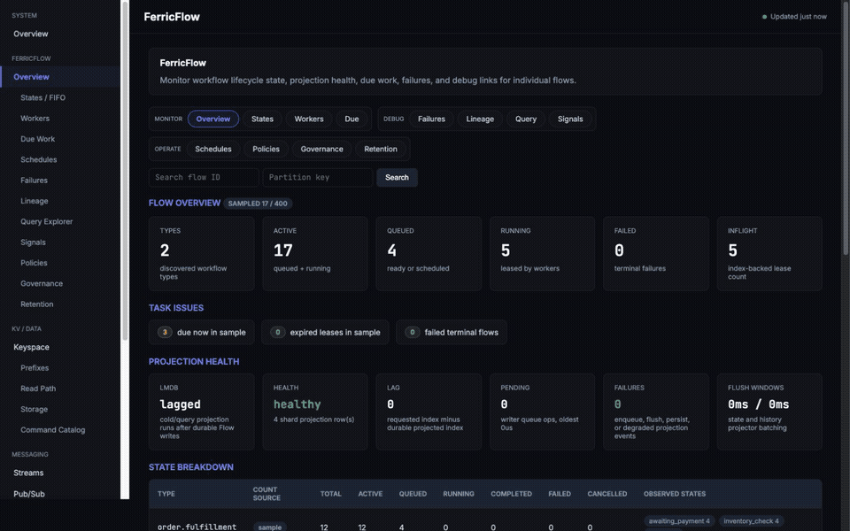

# FerricStore

[](https://hex.pm/packages/ferricstore)
[](https://hexdocs.pm/ferricstore)
[](https://github.com/ferricstore/ferricstore/actions/workflows/test.yml)
[](https://opensource.org/licenses/Apache-2.0)

**FerricStore is an open-source durable workflow and queue server.**

Applications run ordinary handler code in their own services. FerricStore
persists one Flow for each job or process, makes named states claimable under
leases and fencing, and records every transition, retry, signal, and terminal
outcome.

```text
create -> claim a state -> run handler -> transition / retry / complete / fail
```

Start with a durable queue. Evolve the same Flow into a multi-service state
machine, then add bounded queries, schedules, policies, and governance as the
workflow grows. FerricStore does not replay handler code or require application
code to run inside the server.

FerricFlow runs on the same sharded, Raft-backed engine that FerricStore exposes
as a durable key-value and data-structure store.

## Start Locally

Run one development node:

```bash
docker run -p 6388:6388 -p 6380:6380 -p 6381:6381 \
  -e FERRICSTORE_PROTECTED_MODE=false \
  -v ferricstore_data:/data \
  quay.io/ferricstore/ferricstore:0.11.9
```

Published SDKs connect to `ferric://127.0.0.1:6388`. The operations dashboard
is at <http://127.0.0.1:6380/dashboard>, metrics are at `/metrics`, and isolated
liveness/readiness probes use port `6381`.

`FERRICSTORE_PROTECTED_MODE=false` is for local development only. With
protected mode enabled, bootstrap the first durable ACL user at
`/dashboard/setup`, then sign in at `/dashboard/login`. See
[Getting Started](guides/getting-started.md) for SDK setup and
[Security](guides/security.md) before exposing a server.

## OSS Capability Map

The FQL1 query planner, schedules, governance primitives, and operations
dashboard are included in this OSS repository and release image; they are not
enterprise-only add-ons.

| Area | Included in FerricStore OSS `0.11.9` |
| --- | --- |
| Durable KV and data structures | Strings, hashes with field TTL, lists, sets, sorted sets, streams and consumer groups, Pub/Sub, transactions, blocking reads, bitmaps, HyperLogLog, GEO, Bloom and Cuckoo filters, Count-Min Sketch, TopK, and TDigest. |
| FerricStore-native helpers | Compare-and-swap, fenced distributed locks, fixed-window rate limiting, cache-aside/stampede protection, key diagnostics, quotas, and cluster inspection. |
| Durable queues and workflows | `FLOW.CREATE`, batched create/mutation commands, fused `FLOW.START_AND_CLAIM`, `FLOW.STEP_CONTINUE`, and `FLOW.RUN_STEPS_MANY`, state-specific `FLOW.CLAIM_DUE`, leases and fencing, transitions, retry, complete, fail, cancel, reclaim, rewind, history, and retention cleanup. |
| Query engine | `FLOW.QUERY` with FQL1 point, collection, exact-count, history, lineage, metadata, and lease-deadline queries; bounded indexes, field projection, cursors, statistics, `EXPLAIN`, `EXPLAIN ANALYZE`, and `FLOW.QUERY.INDEXES`. |
| Scheduling | Durable one-shot, delayed, interval, and cron schedules; pause/resume/delete, bounded interval catch-up, overlap policies, maximum fires, automatic due execution, and explicit administrative firing. |
| Policies and lifecycle | Type policy generations with compare-and-swap, per-state FIFO or parallel execution, fixed/exponential retry policies, exhaustion routing, maximum active lifetime, indexed attributes/state metadata, and resumable policy migrations. |
| Workflow coordination | Durable signals, parent/child fanout, lineage, named value refs, state metadata, idempotent creation, and independently claimable workflow states. |
| FlowGuard governance | Durable effect reservations, approvals, circuits, budgets, strict leased concurrency limits, per-Flow governance ledgers, global overview/list surfaces, and structured denials. |
| Operations | Browser dashboard, local operational Mix CLI, Flow query and index inspection, schedules, policies, governance, failures, retention, storage, keyspace, clients, streams, Pub/Sub, slow log, Raft/consensus, doctor diagnostics, health probes, and Prometheus metrics. |
| Security | Protected mode, named ACL users, command/key/channel rules, dashboard bootstrap/login and ACL-scoped accounts, TLS/mTLS, trusted-proxy controls, CSRF/origin validation, login throttling, session revocation, and audit logging. |
| Durability and deployment | Sharded WARaft consensus, disk-backed authoritative records, restart recovery, compaction, memory pressure/admission controls, multi-node routing, Docker multi-arch images, ephemeral single-task and three-node AWS Fargate OSS profiles, Kubernetes, bare-metal releases, and embedded mode. |

## Scope And Boundaries

- The native wire protocol is FerricStore's multiplexed typed binary protocol,
  not Redis RESP. Command snippets in this README show logical command names;
  SDKs send typed native frames and values.
- FerricFlow is a durable state, queue, and coordination engine. It does not
  replay handler code or require handlers to run inside FerricStore.
- FQL1 is a deliberately bounded Flow query language, not general SQL. It
  rejects shapes for which the server cannot produce an advertised bounded
  plan.
- `partition_key` is an application routing, co-location, and bounded-query
  key. It is not an OSS tenant-control-plane requirement.
- FQL does not return payload, result, error, named-value, lease-token, fencing,
  or retention fields. QueryRows and covering indexes hold query-visible
  metadata; payload/value bytes are hydrated through point, claim, or value-ref
  APIs when explicitly requested.
- FerricStore uses familiar Redis-style logical command names for many data
  structures, but compatibility is command-specific. It is not a drop-in Redis
  wire server; use the Ferric native SDKs or embedded Elixir API.

## Interfaces And Published SDKs

The published SDKs use the same Ferric native protocol. Their current release
lines are compatibility-tested against the OSS server at version `0.11.9`:

| Interface | Package or module | Source |
| --- | --- | --- |
| Python | [`ferricstore`](https://pypi.org/project/ferricstore/) | [`ferricstore/ferricstore-python`](https://github.com/ferricstore/ferricstore-python) |
| Go | [`github.com/ferricstore/ferricstore-go`](https://pkg.go.dev/github.com/ferricstore/ferricstore-go) | [`ferricstore/ferricstore-go`](https://github.com/ferricstore/ferricstore-go) |
| Elixir native client | [`ferricstore_sdk`](https://hex.pm/packages/ferricstore_sdk) | [`ferricstore/ferricstore-elixir`](https://github.com/ferricstore/ferricstore-elixir) |
| TypeScript / Node.js | [`@ferricstore/ferricstore`](https://www.npmjs.com/package/@ferricstore/ferricstore) | [`ferricstore/ferricstore-typescript`](https://github.com/ferricstore/ferricstore-typescript) |
| Embedded Elixir server API | [`ferricstore`](https://hex.pm/packages/ferricstore) | This repository |
| Local operational CLI | `mix ferricstore.*` tasks | This repository |

All four native SDK release lines retain FerricStore `0.11.4` as their
minimum server version and negotiate the Stream mode-34 producer fast path when
the server advertises it. Native wire protocol v1 is unchanged.
No Java SDK is currently published.

## Beta Status

FerricStore is currently a `0.x` beta release. The core durability path, Flow
commands, precompiled NIFs, Docker image, and SDKs are published and usable, but
public APIs, command details, operational defaults, and storage/projection
internals may still change before `1.0`.

Beta does not mean lightly tested. The project is thoroughly tested across the
durability path, FerricFlow workflow commands, FQL1 and index lifecycle, durable
schedules, governance, Rust NIFs, storage behavior, security, dashboard/API
surfaces, the embedded API, published SDK integration suites, restart/recovery,
cluster/quorum behavior, benchmarks, and longer soak runs.

Use it today for development, benchmarks, pilots, and controlled production
experiments. For critical production workloads, pin exact versions, test
upgrades on your data model, and expect compatibility guarantees to harden with
the `1.0` release line.

## What Is A Flow?

A Flow is one durable workflow record:

| Field | Meaning |
| --- | --- |
| `type` | Workflow or queue type, such as `email` or `order`. |
| `id` | Application-defined Flow id. |
| `partition_key` | Routing/co-location boundary required by bounded collection queries and FIFO lanes. |
| `state` | Current durable state, such as `queued`, `created`, or `charged`. |
| `attributes` | Small indexed metadata for Flow query, stats, and dashboard filters. |
| `state_meta` | Metadata retained independently for each logical state; one policy-selected key can be indexed. |
| `payload` / value refs | Small routing payload plus optional named values stored separately. |
| lease | Worker claim ownership with fencing. |
| history | State changes, signals, retries, and terminal events. |
| lineage | Parent, root, and correlation identities for fanout and cross-service inspection. |
| terminal status | Completed, failed, cancelled, or still active. |

The core loop is explicit:

```text
FLOW.CREATE -> FLOW.CLAIM_DUE -> handler -> FLOW.TRANSITION / COMPLETE / FAIL / RETRY
```

Queue workers usually process one state and complete/fail/retry. Workflow workers process multiple named states and return explicit transitions.

A long workflow does not need to live in one codebase or one workflow runtime. One service can claim `fraud_check`, another can claim `charge_card`, and another can claim `send_email`; the work moves by durable state transition instead of ad hoc queue messages, retry tables, and status tables.

## Command-Line Tools

FerricStore ships operational Mix tasks for source checkouts and embedded
Elixir deployments. These tasks start and operate on the default local
FerricStore application; they are not a standalone shell for a remote native
TCP server. Use a published SDK or the operations dashboard for remote access.

| Task | Purpose |
| --- | --- |
| `mix ferricstore.info` | Show uptime, shard/key counts, memory, connection/command counters, and Raft leader status. |
| `mix ferricstore.keys [glob]` | Stream keys with optional `*`/`?` filtering through bounded cursor pages. |
| `mix ferricstore.config get/set ...` | Inspect or update local namespace commit-window configuration. |
| `mix ferricstore.merge [shard]` | Trigger the normal merge/compaction eligibility check for one or all local shards. |
| `mix ferricstore.redis_compat matrix/assess ...` | Generate a Redis compatibility matrix or assess a captured workload in Markdown or JSON. |
| `mix ferricstore.recovery_kill9 ...` | Run the manual child-process kill/restart recovery benchmark; this is a diagnostic benchmark, not routine administration. |

Run `mix help ferricstore.info` or the corresponding task name for its complete
arguments and behavior.

## First Flow Over The Ferric Native Protocol

FerricFlow commands are exposed over FerricStore's native binary TCP protocol, so SDK clients can use multiplexed lanes, request ids, ACLs, TLS, and bounded backpressure. Durability is the default contract: a workflow command returns success only after the state change is accepted through the quorum path and written to disk.

Durable queue item:

```text
FLOW.CREATE email-1 TYPE email STATE queued PAYLOAD "welcome:user-1"
FLOW.CLAIM_DUE email STATE queued WORKER worker-1 LIMIT 100
FLOW.COMPLETE email-1 <lease-token> FENCING <fencing-token> RESULT "sent"
```

Explicit state transition:

```text
FLOW.CREATE order-1 TYPE order STATE created PAYLOAD "order payload"
FLOW.CLAIM_DUE order STATE created WORKER worker-1 LIMIT 1
FLOW.TRANSITION order-1 running charged LEASE_TOKEN <lease-token> FENCING <fencing-token>
FLOW.CLAIM_DUE order STATE charged WORKER worker-1 LIMIT 1
FLOW.COMPLETE order-1 <lease-token> FENCING <fencing-token> RESULT "ok"
```

Flow commands and normal FerricStore commands can be pipelined on the same native connection.
Latency-sensitive workers can use `FLOW.START_AND_CLAIM` and
`FLOW.STEP_CONTINUE` to combine state mutation with the next lease, while
`FLOW.RUN_STEPS_MANY` executes a bounded same-partition batch. These are durable
server commands, not client-side emulation.

## Querying Flows With FQL1

`FLOW.QUERY` is the canonical read and query envelope for Flow state. FQL1 is
SQL-shaped, but it is purpose-built for bounded workflow queries and exposes
only plans advertised by the server capability manifest.

```text
FLOW.QUERY FQL1 "FROM runs WHERE partition_key = @partition AND type = @type AND state IN ('queued', 'retrying') ORDER BY updated_at_ms DESC LIMIT 100 RETURN RECORDS (run_id, state, updated_at_ms, attribute['region'])" partition tenant-a type order

FLOW.QUERY FQL1 "FROM runs WHERE partition_key = @partition AND type = @type RETURN COUNT" partition tenant-a type order

FLOW.QUERY FQL1 "EXPLAIN ANALYZE FROM runs WHERE partition_key = @partition AND type = @type AND state = 'failed' ORDER BY updated_at_ms DESC LIMIT 50 RETURN RECORDS" partition tenant-a type order

FLOW.QUERY.INDEXES
```

The OSS query engine includes:

- authoritative point reads plus bounded collections, exact counts, event
  history, lineage, metadata, and lease-deadline sources;
- equality, `IN`, `BETWEEN`, time windows, `NULL`, `MISSING`, typed parameters,
  stable ordering, bounded limits, and opaque cursor pagination;
- source-specific field projection, including `attribute.*` and
  `state_meta.*`, to avoid decoding and transferring fields the caller did not
  request;
- cost-aware plan selection, statistics, rejected alternatives, actionable
  errors, `EXPLAIN`, and ACL-controlled `EXPLAIN ANALYZE`;
- durable index build, validation, activation, retirement, statistics
  freshness, resumable backfill, and pressure-aware operation, visible through
  `FLOW.QUERY.INDEXES` and the dashboard; and
- the negotiated `flow_query_result_v1` compact typed-binary result codec, with
  the ordinary typed-value codec retained as a lossless fallback.

Current query state is checked against authoritative Flow storage where the
selected plan requires hydration. Metadata-only and covered projections can be
served directly from the compact QueryRow/index snapshot. Every scan, result
page, decoded byte count, native response, memory reservation, and deadline is
bounded.

The beta commands `FLOW.LIST`, `FLOW.SEARCH`, `FLOW.TERMINALS`,
`FLOW.FAILURES`, `FLOW.STUCK`, `FLOW.BY_PARENT`, `FLOW.BY_ROOT`, and
`FLOW.BY_CORRELATION` are not supported. SDK convenience methods compile those
use cases to `FLOW.QUERY`; new integrations should use FQL1 directly when they
need control over predicates, fields, order, pagination, counts, or explain
output.

See the [Flow Query Guide](docs/flow-query.md) for the grammar, result contract,
index lifecycle, ACL model, diagnostics, and tuning.

## Schedules, Policies, And Governance

### Durable schedules

Schedules are durable Flow records. FerricStore supports one-shot timestamps,
relative delays, fixed intervals, and cron expressions with timezones.

```text
FLOW.SCHEDULE.CREATE billing-sweep KIND interval EVERY_MS 60000 CATCHUP_POLICY fire_once OVERLAP_POLICY queue_after_previous TARGET <typed-map>
FLOW.SCHEDULE.GET billing-sweep
FLOW.SCHEDULE.LIST KIND interval STATE active COUNT 100
FLOW.SCHEDULE.PAUSE billing-sweep
FLOW.SCHEDULE.RESUME billing-sweep
FLOW.SCHEDULE.DELETE billing-sweep
```

The built-in scheduler performs automatic due execution. Interval recovery uses
bounded O(1) `fire_once` catch-up: it creates one target, records how many
occurrences were coalesced, and advances to the next interval without replaying
an unbounded burst. Overlap policies, optional queue-after-previous retry,
maximum fires, end times, and planning failures are persisted and inspectable.
`FLOW.SCHEDULE.FIRE` and `FLOW.SCHEDULE.FIRE_DUE` are available for explicit
administration and custom-scheduler deployments.

### Type and state policies

`FLOW.POLICY.SET` installs a replicated type policy. Policy updates merge by
default, return a monotonic generation, and support compare-and-swap with
`EXPECTED_GENERATION`; `REPLACE TRUE` performs an intentional full replacement.

```text
FLOW.POLICY.SET order MAX_ACTIVE_MS 300000 INDEXED_ATTRIBUTES region \
  MAX_RETRIES 5 BACKOFF exponential BASE_MS 100 MAX_MS 30000 \
  STATE queued MODE FIFO STATE review MODE PARALLEL
```

Policies cover fixed or exponential retry and exhaustion routing, maximum
non-terminal lifetime, indexed attributes, one indexed state-metadata key, and
per-state FIFO or parallel execution. FIFO ordering is scoped to a
type/state/partition lane, survives restart and hibernation, and cannot be
overridden by an individual create or claim. Policy/index migrations are
durable, bounded, resumable, and ordered by policy generation.

### FlowGuard governance

FlowGuard keeps workflow-side control state in FerricStore rather than an
external coordination database:

- `FLOW.EFFECT.*` reserves, confirms, fails, compensates, and reads fenced
  side-effect attempts with idempotency information.
- `FLOW.APPROVAL.*` requests, approves, rejects, gets, and lists durable human or
  service approvals.
- `FLOW.CIRCUIT.*` opens, closes, and reads durable circuit state.
- `FLOW.BUDGET.*` reserves, commits, releases, gets, and lists fixed-window
  budgets.
- `FLOW.LIMIT.*` leases, spends, releases, gets, and lists durable strict global
  concurrency credits without a cross-shard transaction on every claim.
- `FLOW.GOVERNANCE.LEDGER` and `FLOW.GOVERNANCE.OVERVIEW` expose per-Flow audit
  and global operational summaries.

Governance enforcement is fail-closed and structured, but its claim/terminal
hot-path integration is opt-in: callers provide the governance limit scope and
shard identity when strict running capacity should be spent and released.
Workloads that do not enable governance do not pay governance work on ordinary
Flow claims. See [FerricFlow Governance](docs/flow-governance-design.md) for the
implemented surface and enforcement boundaries.

## Python Quick Start

Install:

```bash
pip install ferricstore
```

Durable queue:

```python
from ferricstore import QueueClient

client = QueueClient.from_url("ferric://127.0.0.1:6388")
emails = client.queue(type="email")

emails.enqueue("email-1", payload=b"welcome:user-1", idempotent=True)


def send_email(job):
    print(job.id, job.payload)
    return b"sent"


emails.worker(concurrency=10, batch_size=100).run(send_email)
```

Explicit state-machine workflow:

```python
from ferricstore import WorkflowClient, complete, transition

client = WorkflowClient.from_url("ferric://127.0.0.1:6388")
order = client.workflow(type="order", initial_state="created")


@order.state("created")
def created(job):
    charge_card(job.payload)
    return transition("charged")


@order.state("charged")
def charged(job):
    send_receipt(job.id)
    return complete(result=b"ok")


order.start("order-1", payload=b"order payload", idempotent=True)
order.worker(states=["created", "charged"]).run()
```

The SDK handles claim leases and fencing. Handlers return durable outcomes such as `transition(...)`, `complete(...)`, `retry(...)`, or `fail(...)`.

Python SDK links:

- Package: <https://pypi.org/project/ferricstore/>
- Repository: <https://github.com/ferricstore/ferricstore-python>

## Core FerricFlow Primitives

- **Multi-language queue-to-workflow upgrade** - services using the published
  Python, Go, Elixir, or TypeScript SDKs can claim specific Flow states,
  transition work forward, and share one durable record for retries, leases,
  history, and terminal status.

### Signals

Signals record external events durably and can optionally move a Flow to another state.

```python
from ferricstore import WorkflowClient

client = WorkflowClient.from_url("ferric://127.0.0.1:6388")
approval = client.workflow(type="approval", initial_state="waiting")
approval.start("approval-1", payload=b"invoice:123", idempotent=True)

approval.signal(
    "approval-1",
    signal="approved",
    if_state="waiting",
    transition_to="approved",
    idempotency_key="approve-approval-1",
)
```

### Value Refs

Named values let a Flow store large or optional bytes separately from hot state. Workers hydrate only the values they ask for.

```python
from ferricstore import QueueClient

client = QueueClient.from_url("ferric://127.0.0.1:6388")
orders = client.queue(type="order")

orders.enqueue(
    "order-1",
    payload=b"small routing bytes",
    values={"invoice": invoice_pdf_bytes, "customer": customer_snapshot_bytes},
)

orders.worker(claim_values=["customer"]).run(handle_customer_step)
```

### Fanout

A parent Flow can spawn child Flows. Children run independently with their own state, retries, leases, history, and terminal status; parent/child links are queryable later.

```python
from ferricstore import ChildSpec, WorkflowClient, transition

client = WorkflowClient.from_url("ferric://127.0.0.1:6388")
campaign = client.workflow(type="campaign", initial_state="dispatch")


@campaign.state("dispatch")
def dispatch(job):
    job.flow.spawn_children(
        [
            ChildSpec(
                id=f"device:{device_id}:cmd:{job.id}",
                type="device-command",
                payload=device_id.encode(),
            )
            for device_id in device_ids
        ],
        wait_state="done",
    )
    return transition("waiting_for_children")
```

## Failure Model

- Flow state is durable before `FLOW.CREATE`, transition, retry, complete, fail, or cancel returns success.
- `FLOW.CLAIM_DUE` grants a lease token and fencing token to a worker.
- Terminal or transition commands must present the current lease/fencing data, so stale workers cannot overwrite newer claims.
- If a worker crashes after claiming, the Flow becomes claimable again after the lease expires or is reclaimed.
- Handlers are normal application code. FerricFlow does not replay handler code to recover state.
- History and cold query projections may lag briefly, but current Flow state is the source of truth.

## Operations Dashboard And Security

The OSS server includes a browser operations dashboard on the combined HTTP
port. It is an operational surface, not a separate control-plane service. Pages
cover server overview, command/read activity, keyspace and prefixes, storage and
merge state, clients, streams, Pub/Sub, slow log, configuration, capabilities,
Raft/consensus, doctor diagnostics, and the full Flow surface: lookup, states,
workers, due work, FQL queries, index projections, lineage, signals, schedules,
policies, governance, failures, and retention.



The Flow query page includes Guided and FQL workbench modes. It accepts typed
JSON parameters, field projections, exact counts, `EXPLAIN`, and `EXPLAIN
ANALYZE`; preserves query quality and resource usage; continues opaque cursors
through POST; keeps lifecycle state separate from the current workflow step;
discovers policy-indexed metadata and bounded top values for a selected
workflow type; samples observed type suggestions with a projection-only query;
and can visualize the ACL-filtered current page without issuing a second query.
Page charts are labeled as page-scoped and are not presented as global grouped
results.

In protected mode:

- a factory ACL catalog bootstraps through `/dashboard/setup` and then disables
  setup;
- users sign in through `/dashboard/login` with the same durable ACL identities
  used by native TCP;
- `/dashboard/security` supports ACL-scoped named-account management;
- every page and form action checks its underlying command plus key/channel
  permission, so an observer cannot invoke an administrator action;
- signed sessions are revoked immediately after password, enabled-state, rule,
  or user changes; and
- POST requests use origin and CSRF validation, while login/bootstrap attempts
  are rate-limited and audited.

Remote dashboard access requires an explicitly trusted HTTPS proxy, trusted
proxy CIDRs, a shared session secret, and a file-backed bootstrap token. The
server also exposes Prometheus-compatible `/metrics`, combined-port dashboard
JSON endpoints, and isolated liveness/readiness probes. See
[Security](guides/security.md) for ACL, dashboard, TLS/mTLS, audit, and proxy
configuration.

## Durability And Storage Model

FerricStore also exposes a durable key-value/data-structure store through the native protocol and embedded API:

```text
SET user:42:name alice
GET user:42:name
HSET order:1 status paid
ZADD due 1700000000000 flow-1
```

Writes go through Raft consensus and disk-backed storage before success is reported. There is no separate mode to turn persistence on.

The high-level data path is:

```text
native SDK / embedded API
          |
          v
deterministic shard routing -> WARaft quorum commit -> append/apply storage
                                                    -> hot keydir/native indexes
                                                    -> async history + LMDB query projection
```

Authoritative Flow records remain in the Raft segment/apply-projection storage
path. Hot keydir/native indexes serve current state. LMDB stores one compact
QueryRow per current Flow plus composite index entries; it does not duplicate
the full record or payload. A QueryRow contains bounded query-visible metadata
and one checked physical log locator. Composite entries contain identity,
version, expiry, and declared covering fields, but do not copy the payload or
locator.

This layout lets covered FQL projections and counts avoid authoritative-log
reads while keeping point, history, lineage, and payload-dependent reads
bounded and validated. Compaction relocates the central QueryRow locator with a
compare-and-swap instead of rewriting every composite index. Query backfill,
hydration, native merge, and admission are limited by rows, bytes, memory,
deadlines, and MemoryGuard pressure.

Rust NIFs implement bounded storage and codec paths. Portable grouped
`pread`/`pwrite` behavior remains available across supported platforms, while
Linux builds carry io_uring parity coverage for the applicable asynchronous I/O
paths.

| Property | How |
| --- | --- |
| Atomic | Each command is one Raft log entry, applied or not. |
| Consistent | Raft linearizability for committed writes. |
| Isolated | Single-threaded state machine per shard. |
| Durable | WAL, disk-backed storage, and Raft quorum before ack. |

The KV store is not just `SET`/`GET`: it also includes hashes, lists, sets,
sorted sets, durable streams, live Pub/Sub notifications, bitmaps, HyperLogLog,
GEO, probabilistic structures, CAS, locks, rate limits, and cache-aside helpers.
See [Key-Value Store](guides/kv-store.md) for the model, write/read path, TTL
behavior, hot/cold storage, streams vs Pub/Sub, and key design.

## Embedded Elixir

FerricStore can also run inside an Elixir application.

```elixir
# mix.exs
{:ferricstore, "~> 0.11.9"}
```

```elixir
:ok = FerricStore.set("user:42:name", "alice", ttl: :timer.hours(1))
{:ok, "alice"} = FerricStore.get("user:42:name")
```

FerricFlow is also available through embedded `FerricStore.flow_*` functions and the high-level Elixir Flow SDK.

## Documentation

Start here:

- [Getting Started](guides/getting-started.md) — installation, configuration, first commands.
- [Key-Value Store](guides/kv-store.md) — how the durable KV/data-structure store works.
- [Workflow usage examples](docs/flow-vs-temporal-usage.md) — queues, workflows, retries, fanout, signals, and value refs.
- [Native protocol](docs/native-protocol.md) — typed framing, values, opcodes, compact query results, multiplexing, routing, and backpressure.
- [Benchmarks](docs/benchmarks.md) — latest Azure FerricFlow results and native KV benchmark requirements.

FerricFlow:

- [Flow command reference](guides/commands.md) — `FLOW.*` command syntax and FerricStore command behavior.
- [Flow query guide](docs/flow-query.md) — FQL1 syntax, result-field projection, binary results, EXPLAIN, indexes, operations, security, and tuning.
- [Flow schedules](docs/flow-schedules.md) — durable one-shot, interval, and cron schedules, catch-up, overlap, and recovery semantics.
- [Flow retry policy](docs/flow-retry-policy.md) — type/state retry policies and retry exhaustion behavior.
- [FlowGuard governance](docs/flow-governance-design.md) — effects, approvals, circuits, budgets, strict limits, ledgers, and opt-in enforcement.
- [Flow production readiness](docs/flow-production-readiness.md) — operational model, lagged projections, retention, reclaim, and production tuning.
- [Elixir Flow SDK](guides/flow-elixir-sdk.md) — high-level embedded workflow/state-machine API over core Flow commands.

Operations and reference:

- [Architecture](guides/architecture.md) — write path, read path, storage, Raft consensus.
- [Commands Reference](guides/commands.md) — FerricStore command syntax, native protocol mapping, and FerricFlow commands.
- [Embedded Mode](guides/embedded-mode.md) — in-process Elixir setup, command coverage, storage, and multiple instances.
- [Redis Migration Guide](guides/redis-migration.md) — compatibility matrix generation, workload assessment, and import strategy.
- [Configuration](guides/configuration.md) — server config and production defaults.
- [Deployment](guides/deployment.md) — Docker, AWS Fargate, Kubernetes, bare metal, clustering.
- [AWS Fargate single-task support](docs/aws-fargate-single-task.md) — exact OSS contract, architecture, lifecycle, and data-loss behavior.
- [AWS Fargate cluster support](docs/aws-fargate-cluster.md) — three stable node slots, discovery, replacement recovery, guarded upgrades, and failure limits.
- [Security](guides/security.md) — ACL, protected mode, dashboard accounts, TLS/mTLS, trusted proxies, and audit logging.
- [Best Practices](guides/best-practices.md) — pipelining, key design, partitioning.
- [Changelog](CHANGELOG.md) — release-by-release capability and compatibility changes.

## Contributing

See [CONTRIBUTING.md](CONTRIBUTING.md). For security issues, see [SECURITY.md](SECURITY.md).

## License

Apache-2.0
