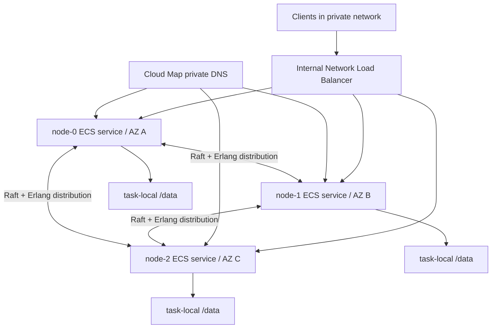

# AWS Fargate Cluster Support

Status: supported OSS profile with an explicit ephemeral-replica failure
contract.

Implementation:
[`deploy/aws/fargate-cluster`](https://github.com/ferricstore/ferricstore/tree/main/deploy/aws/fargate-cluster)

The Terraform input intentionally has no default image. Use an image built from
this repository revision or a later release and pin its digest. The older
`0.11.5` image predates the stable release identity, periodic EPMD reconnect,
and rollout recovery check required by this profile.

## What A Fargate Task Means

The closest Kubernetes mapping is:

| Amazon ECS | Kubernetes | FerricStore cluster profile |
|---|---|---|
| Task definition revision | Pod template | Image, ports, environment, health, and disk size for one node |
| Running task | Pod | One FerricStore process and its task-lifetime `/data` disk |
| ECS service | Stateful controller for one slot | Keeps exactly one logical node running and replaces it when necessary |
| ECS cluster | Scheduler boundary | Runs the three services; it is not the FerricStore Raft cluster |
| Cloud Map service | Headless per-pod DNS identity | Moves one stable slot name to its current task IP |

A single Fargate task cannot be a fault-tolerant cluster. This profile is one
Terraform deployment with three tasks, because a three-voter Raft cluster needs
three independently failing processes and disks.

## Architecture



Each slot has one stable logical node name, one Cloud Map A record, one ECS
service, one task definition family, and one NLB target group. Its private IP
and disk are replaceable implementation details.

## How Nodes Discover One Another

1. Fargate creates a task ENI and gives the task a private IP. The IP is not
   stable and the ENI is removed when the task stops.
2. ECS registers that IP in the slot's Cloud Map service. The names are
   `node-0.<namespace>`, `node-1.<namespace>`, and `node-2.<namespace>`.
3. The task waits until its own stable DNS name resolves to its current IP. This
   prevents an old five-second DNS answer from becoming its advertised name.
4. FerricStore starts with the stable BEAM identity
   `ferricstore@node-N.<namespace>` and a strong cookie shared by all nodes.
   The task sets long-name release distribution plus
   `RELEASE_NODE`/`RELEASE_COOKIE` (before the BEAM starts) and FerricStore's
   matching runtime variables. Startup fails closed if those identities
   disagree.
5. Every node has the same explicit `FERRICSTORE_CLUSTER_NODES` list. The
   `epmd` libcluster strategy retries the list every five seconds, resolving DNS
   again on each connection attempt.
6. EPMD on TCP `4369` tells a peer to use the fixed Erlang distribution port
   `9100`. The task security group permits both ports only from itself.
7. A successful connection emits `nodeup`. `Ferricstore.Cluster.Manager`
   recognizes the name as a configured voter, cancels any delayed removal, and
   drives Raft recovery. A blank replacement receives missing snapshots and log
   entries from the surviving quorum.

The NLB DNS name is the stable client bootstrap endpoint. SDK route metadata
advertises the three per-slot Cloud Map names, so clients never need a raw task
IP.

AWS documents that each Fargate task receives its own ENI, ECS service discovery
registers the task private IP, and the DNS form is
`<service>.<namespace>`: [Fargate task networking](https://docs.aws.amazon.com/AmazonECS/latest/developerguide/fargate-task-networking.html),
[ECS service discovery](https://docs.aws.amazon.com/AmazonECS/latest/developerguide/service-discovery.html).

## Replacement Sequence

For one failed slot:

1. The old task stops; its IP, ENI, and `/data` are lost.
2. The other two voters retain quorum and continue serving.
3. The slot's ECS service starts a blank replacement in its assigned AZ.
4. ECS changes the Cloud Map record to the replacement IP.
5. Peer discovery retries the unchanged logical node name and reconnects.
6. Raft catches the replacement up from the surviving nodes.
7. The recovery check becomes true only when all configured nodes are connected,
   all shards have full membership, and the replacement's durable position has
   reached within ten entries of each shard leader's durable position. A small
   bound is necessary because normal background work can advance a leader
   between the local and remote samples; a snapshot-scale lag remains closed.

The repository includes a cluster integration test that kills a node, writes
while it is absent, restarts the same logical identity with a new empty data
directory, and verifies both old and intervening data on the replacement.

## Failure And Change Contract

| Event | Expected behavior | Supported? |
|---|---|---|
| Process or task failure in one slot | ECS creates a blank replacement; two survivors keep quorum; replacement catches up | Yes |
| One AZ unavailable | Its pinned slot remains absent; the other two nodes keep quorum | Yes, while the remaining nodes and network are healthy |
| One task receives a new IP | Cloud Map moves the stable name; periodic EPMD discovery reconnects | Yes |
| Sequential image upgrade | One blank task at a time, with a full-recovery gate between slots | Yes, through the supplied script |
| DNS briefly returns an old address | Task startup waits for its own address; peers retry every five seconds | Yes |
| Temporary loss of quorum | Readiness fails, but liveness does not ask ECS to destroy more replica disks | Degraded until quorum returns |
| Two task disks lost or replaced together | Only one old replica may remain; quorum and safe automatic recovery are not guaranteed | No |
| All three tasks/disks lost or stack destroyed | No remaining source exists from which to rebuild | Data loss |
| Autoscaling or desired count other than one per slot | Duplicate identities or uncoordinated members | No |
| Parallel `aws ecs update-service` on multiple slots | Multiple local copies disappear together | No |
| Client caches a raw task IP | Connection breaks after replacement | No; clients must use NLB/Cloud Map names |

Fargate task retirement and replacement are normal platform events, not rare
disasters. AWS describes retirement behavior in
[Fargate task maintenance](https://docs.aws.amazon.com/AmazonECS/latest/developerguide/task-maintenance.html).

## Why ECS Health Uses Liveness

Kubernetes separates readiness from restart: an unready Pod can stay alive and
recover. An ECS service can treat failed container or load-balancer health as a
reason to stop and replace its task. With task-local disks, a readiness-induced
replacement loop would repeatedly erase a recovering replica and could cascade
during a quorum outage.

Therefore the ECS and NLB automation checks `/health/live`. Operators can use
`/health/ready`; sequential upgrades use the stricter
`Ferricstore.Cluster.Recovery.ready?()` check. This prioritizes retaining local
replicas over hiding every recovering target from the NLB. Applications should
retry transient errors during a replacement.

AWS documents unhealthy task replacement and deployment percentages in
[ECS service behavior](https://docs.aws.amazon.com/AmazonECS/latest/developerguide/ecs_services.html).

## Upgrade Safety

Each ECS service uses minimum healthy percent `0` and maximum percent `100`.
That intentionally stops the old task before starting its replacement, because
two simultaneous tasks with the same Erlang node name are unsafe.

Terraform ignores service `task_definition` changes. Applying a new image only
registers new revisions, and `skip_destroy` keeps the service's previous
revision active so ECS can still replace its old task before the rollout reaches
that slot. The supplied rollout script then:

1. updates one service;
2. waits for ECS stability;
3. uses ECS Exec to poll the node's strict recovery status;
4. refuses to continue if recovery does not converge; and
5. repeats for the next slot.

This protects image changes. Some Terraform changes to an ECS service, load
balancer, network, or service registry can independently start a deployment;
those changes require a one-slot-at-a-time maintenance plan.

## Storage And The No-S3/No-DynamoDB Decision

FerricStore data is stored only on three task-local Fargate ephemeral volumes.
There is no S3, DynamoDB, EFS, or EBS data plane in this profile. S3 and
DynamoDB are not required for node discovery or normal Raft operation.

The tradeoff is mathematical rather than AWS-specific: replication can rebuild
one missing copy only while enough other copies remain. An orchestrator can
restart tasks, but cannot reconstruct data after all authoritative copies are
gone. Fargate supports 20 GiB by default and up to 200 GiB of task ephemeral
storage; the image and data share that allocation. See
[Fargate task ephemeral storage](https://docs.aws.amazon.com/AmazonECS/latest/developerguide/fargate-task-storage.html).

AWS Secrets Manager is used only for the Erlang cookie so all nodes can
authenticate distribution connections without writing the secret into
Terraform state. It does not store FerricStore data or membership.

## Production TLS Readiness

The supplied Terraform profile is an internal, plaintext baseline. It exposes
the native protocol through a TCP NLB listener on `6388`, runs Erlang
distribution on `9100`, restricts `4369` and `9100` to the task security group,
and uses a strong cookie to authenticate cluster nodes. A private VPC, security
groups, and the Erlang cookie reduce exposure, but none of them encrypt network
traffic. Fargate storage encryption is encryption at rest and does not change
this network contract.

Production has separate TLS decisions for each traffic path:

| Traffic path | Minimum production treatment |
|---|---|
| SDK/client to NLB and node | FerricStore native TLS on `6389`, server certificate verification, and `FERRICSTORE_REQUIRE_TLS=true` |
| Node to node Raft and cluster messages | Erlang distribution TLS on fixed port `9100`, or a tested ECS Service Connect TLS proxy path |
| EPMD discovery on `4369` | Keep security-group-to-itself isolation; proxy it too if policy requires every inter-task byte encrypted |
| Metrics and HTTP health endpoints | Keep private and security-group scoped; use a TLS sidecar/proxy if policy also requires encryption for observability traffic |

TLS is not a replacement for authorization. Enable protected mode, provision
durable ACL credentials from a secrets system, and keep the strong Erlang
cookie even when mutual TLS is enabled.

### Recommended Client Path: End-To-End Native TLS

Use a TCP NLB listener and TCP target groups on `6389`. TCP passthrough keeps
TLS end to end: the SDK negotiates directly with the FerricStore node selected
by the NLB. Do not change the NLB listener to `TLS` if mutual TLS or application
certificate verification must terminate at FerricStore. AWS documents that a
TCP listener passes encrypted bytes through without decrypting them and that
NLB TLS listeners do not implement mTLS: [NLB listeners](https://docs.aws.amazon.com/elasticloadbalancing/latest/network/load-balancer-listeners.html).

Each task needs the following FerricStore settings:

```text
FERRICSTORE_NATIVE_TLS_PORT=6389
FERRICSTORE_NATIVE_TLS_CERT_FILE=/run/ferricstore-tls/server.crt
FERRICSTORE_NATIVE_TLS_KEY_FILE=/run/ferricstore-tls/server.key
FERRICSTORE_NATIVE_TLS_CA_CERT_FILE=/run/ferricstore-tls/ca.crt
FERRICSTORE_REQUIRE_TLS=true
FERRICSTORE_NATIVE_ADVERTISE_TLS_PORT=6389
```

`FERRICSTORE_NATIVE_TLS_CA_CERT_FILE` enables client-certificate verification.
Omit it only when server-authenticated TLS plus ACL authentication is the
intentional policy. The SDK must trust the issuing CA, verify the server name,
and present its client certificate and key when mTLS is enabled.

Update the task and NLB together:

1. Add a named task port mapping for `6389`.
2. Add a client-CIDR-scoped security-group rule for `6389`.
3. Change the three native target groups and the NLB listener to TCP `6389`.
4. Keep the liveness target-group check on the isolated `6381` HTTP endpoint.
5. Remove client ingress to `6388` after every SDK uses TLS. The plaintext
   listener may still exist inside the task, but `FERRICSTORE_REQUIRE_TLS=true`
   makes it reject plaintext native requests.

Do not use only the NLB name in certificate planning. SDKs bootstrap through
the NLB and then use the three node names in route metadata. Every node
certificate must therefore be valid for both:

- the private Route 53 bootstrap name that points to the NLB, for example
  `ferricstore.internal.example.com`; and
- that task's stable Cloud Map identity, for example
  `node-0.ferricstore.local`.

The AWS-generated NLB hostname is not a certificate identity controlled by the
deployment. Create a private Route 53 alias for it and use that controlled name
in SDK configuration. Prefer one key and certificate per stable node slot. A
shared wildcard certificate is simpler but spreads one private key across all
three failure domains.

### Recommended Cluster Path: Erlang Distribution TLS

The least disruptive way to encrypt Raft and cluster messages is Erlang/OTP
distribution TLS. It preserves the current Cloud Map identities, periodic EPMD
reconnect behavior, and fixed distribution port.

Give every node a certificate signed by the same internal CA and create
`/run/ferricstore-tls/inet_tls.conf` with peer verification for both roles:

```erlang
[{server, [
  {certfile, "/run/ferricstore-tls/node.crt"},
  {keyfile, "/run/ferricstore-tls/node.key"},
  {cacertfile, "/run/ferricstore-tls/ca.crt"},
  {verify, verify_peer},
  {fail_if_no_peer_cert, true}
]},
{client, [
  {certfile, "/run/ferricstore-tls/node.crt"},
  {keyfile, "/run/ferricstore-tls/node.key"},
  {cacertfile, "/run/ferricstore-tls/ca.crt"},
  {verify, verify_peer}
]}].
```

Extend, rather than replace, the existing release options so the distribution
port remains deterministic:

```text
ELIXIR_ERL_OPTIONS=+fnu -proto_dist inet_tls -ssl_dist_optfile /run/ferricstore-tls/inet_tls.conf -kernel inet_dist_listen_min 9100 inet_dist_listen_max 9100
```

The task security group should continue to allow `9100` only from itself.
EPMD on `4369` still exchanges discovery metadata in plaintext in this design;
the Raft log, command values, process messages, and other Erlang distribution
payloads use TLS on `9100`. See the complete configuration and security
requirements in [Node-to-Node TLS](../guides/security.md#node-to-node-tls-erlang-distribution).

### Alternative Cluster Path: ECS Service Connect TLS

ECS Service Connect can issue, rotate, and distribute certificates from AWS
Private CA and encrypt traffic between its managed proxies. It can proxy raw
TCP when `appProtocol` is not set. AWS explicitly limits the guarantee to
traffic that passes through the Service Connect agents:
[Service Connect TLS](https://docs.aws.amazon.com/AmazonECS/latest/developerguide/service-connect-tls.html),
[ECS port mappings](https://docs.aws.amazon.com/AmazonECS/latest/APIReference/API_PortMapping.html).

To use it for this topology, all three node services must join the same Service
Connect namespace as clients and servers, and each stable slot must expose
named raw-TCP endpoints for both `epmd` (`4369`) and `distribution` (`9100`).
Configure the TLS issuer CA, ECS infrastructure role, KMS key policy, proxy CPU
and memory, proxy logs, client aliases, and ingress ports. Then make peer
connections resolve the proxy aliases and remove security-group paths that
allow direct cross-task connections to bypass the proxies.

This is not a drop-in switch for the current Terraform:

- the current startup gate expects its Cloud Map identity to resolve to its
  task IP, while Service Connect aliases resolve inside client tasks to the
  managed proxy;
- EPMD returns the port used for the subsequent distribution connection, so
  both stages must follow the same proxy design;
- Service Connect terminates TLS at the agents, leaving task-local proxy-to-app
  traffic unencrypted; and
- NLB clients outside the Service Connect namespace are not covered, so native
  client TLS is still required.

Keep separate Cloud Map identity and Service Connect endpoint names, or update
and test the startup identity gate before reusing a name. The repository does
not currently ship or claim a validated Service Connect variant. Treat it as a
production architecture change and do not remove Erlang distribution TLS until
replacement, recovery, and upgrade tests demonstrate that no cluster path can
bypass the proxies. AWS describes how to verify that TLS starts and terminates
at the two agents in [Verifying Service Connect TLS](https://docs.aws.amazon.com/AmazonECS/latest/developerguide/verify-tls-enabled.html).

### Certificate Delivery And Rotation

Certificates and private keys must not live only on a task's replaceable disk,
inside the container image, or in Terraform state. For native TLS, store the
PEM material in Secrets Manager or another durable secrets system and add an
essential init container that writes it into a task-scoped shared volume before
FerricStore starts. Give the init container only the required
`secretsmanager:GetSecretValue` and KMS permissions, prevent it from logging
secret values, and make private-key files readable only by the FerricStore
runtime user.

ECS secret values injected at container start do not update inside an existing
task after rotation. AWS requires a new task or forced deployment to receive
the new version: [ECS Secrets Manager injection](https://docs.aws.amazon.com/AmazonECS/latest/developerguide/secrets-envvar-secrets-manager.html).
FerricStore also reads its native TLS files at startup. Rotate safely by:

1. publishing a trust bundle that accepts both the old and new CA when the CA
   changes;
2. issuing and storing the new node and client certificates;
3. registering task definition revisions that reference the new secret
   versions;
4. running the supplied one-node-at-a-time rollout script;
5. waiting for strict full-recovery after each replacement; and
6. removing the old CA only after every node and client has moved.

Do not force all three services to deploy simultaneously during certificate
rotation. That would discard all three task-local replicas together and violate
the storage failure contract regardless of whether TLS is configured correctly.

### Production TLS Acceptance Tests

Complete these checks before calling the deployment production-ready:

- A TLS-capable SDK can bootstrap through the private NLB alias, follows route
  metadata to all three stable node names, and can read and write through each.
- Plaintext native connections to `6388` are rejected and the security group no
  longer admits client traffic on that port.
- An SDK using an unknown CA, wrong server name, or missing client certificate
  fails closed before authentication.
- A node using an unknown CA certificate cannot join; a node with the correct
  certificate but wrong cookie also cannot join.
- A one-slot task replacement gets a new IP, reconnects with TLS, catches up
  from the surviving quorum, and passes the strict recovery check.
- Certificate rotation succeeds one slot at a time without quorum loss, and
  old certificates fail after the overlap window closes.
- If Service Connect is selected, agent metrics/logs and AWS's TLS verification
  procedure prove that both EPMD and distribution connections traverse the
  proxies; a direct task-IP attempt is blocked.
- Metrics and health endpoints are either covered by the declared TLS proxy or
  explicitly accepted as private, security-group-scoped plaintext exceptions.

## Prometheus And Fargate Telemetry

FerricStore exposes Prometheus text metrics at `GET /metrics` on the dashboard
port, `6380`. Prometheus should scrape every stable Cloud Map node name directly:

- `node-0.ferricstore.local:6380`
- `node-1.ferricstore.local:6380`
- `node-2.ferricstore.local:6380`

Do not scrape only the NLB. The NLB can route consecutive scrapes to different
tasks, which hides a missing replica and mixes three processes into one target.
The scraper must run in the VPC, a connected network that can resolve the
private namespace, or as another ECS/Fargate service in the VPC.

### Permit Only The Prometheus Scraper

The cluster task security group does not admit port `6380` by default. Add a
security-group-to-security-group rule rather than opening metrics to the whole
VPC. For an existing Prometheus ECS service, this Terraform extension is enough:

```hcl
variable "prometheus_security_group_id" {
  description = "Security group attached to the private Prometheus scraper."
  type        = string
}

resource "aws_vpc_security_group_ingress_rule" "prometheus_metrics" {
  security_group_id            = aws_security_group.task.id
  description                  = "FerricStore metrics from Prometheus only"
  from_port                    = 6380
  to_port                      = 6380
  ip_protocol                  = "tcp"
  referenced_security_group_id = var.prometheus_security_group_id
}
```

The supplied FerricStore profile sets protected mode to `false` and relies on
private networking. If protected mode is enabled, `/metrics` requires an
authorized observability identity; configure the scraper credentials and TLS
according to the security deployment rather than making the endpoint public.

### Prometheus Scrape Configuration

Use the stable DNS names as targets. DNS is resolved again after a failed or
closed connection, so a target continues to work when Cloud Map moves its name
to a replacement task IP.

```yaml
global:
  scrape_interval: 15s
  evaluation_interval: 15s

rule_files:
  - /etc/prometheus/ferricstore-alerts.yml

scrape_configs:
  - job_name: ferricstore
    metrics_path: /metrics
    scheme: http
    static_configs:
      - targets: ["node-0.ferricstore.local:6380"]
        labels:
          node_slot: node-0
      - targets: ["node-1.ferricstore.local:6380"]
        labels:
          node_slot: node-1
      - targets: ["node-2.ferricstore.local:6380"]
        labels:
          node_slot: node-2
```

The scrape exports process, client, memory, persistence, replay-lag, Flow, and
quorum-write metrics. Prometheus automatically adds the `up` metric for each
target, so `up{job="ferricstore"} == 0` identifies the exact unavailable slot.

### Probe Readiness Separately

`/metrics` can remain reachable while a node is alive but unable to serve
because it lacks quorum. Run Prometheus Blackbox Exporter in the private network
and probe each node's isolated `GET /health/ready` endpoint on port `6381`:

```yaml
  - job_name: ferricstore-readiness
    metrics_path: /probe
    params:
      module: [http_2xx]
    static_configs:
      - targets:
          - http://node-0.ferricstore.local:6381/health/ready
          - http://node-1.ferricstore.local:6381/health/ready
          - http://node-2.ferricstore.local:6381/health/ready
    relabel_configs:
      - source_labels: [__address__]
        target_label: __param_target
      - source_labels: [__param_target]
        target_label: instance
      - target_label: __address__
        replacement: blackbox-exporter.monitoring.local:9115
```

Replace the exporter hostname with its private service-discovery name. The
existing Fargate stack permits port `6381` from within its VPC. A failed probe
is exported as `probe_success == 0`. The Blackbox Exporter pattern and relabeling
are documented by [Prometheus](https://prometheus.io/docs/guides/multi-target-exporter/).

### Starter Alert Rules

Store the following as `/etc/prometheus/ferricstore-alerts.yml` and route the
alerts through Alertmanager:

```yaml
groups:
  - name: ferricstore-fargate
    rules:
      - alert: FerricStoreNodeMetricsDown
        expr: up{job="ferricstore"} == 0
        for: 2m
        labels:
          severity: critical
        annotations:
          summary: "FerricStore metrics unavailable on {{ $labels.node_slot }}"

      - alert: FerricStoreNodeNotReady
        expr: probe_success{job="ferricstore-readiness"} == 0
        for: 2m
        labels:
          severity: critical
        annotations:
          summary: "FerricStore readiness failed for {{ $labels.instance }}"

      - alert: FerricStoreQuorumWriteErrors
        expr: sum by (node_slot) (rate(ferricstore_quorum_submit_total{status=~"error|unknown"}[5m])) > 0
        for: 2m
        labels:
          severity: critical
        annotations:
          summary: "FerricStore quorum writes are failing on {{ $labels.node_slot }}"

      - alert: FerricStoreLocalApplyTimeouts
        expr: sum by (node_slot) (increase(ferricstore_batcher_local_apply_timeout_total[5m])) > 0
        labels:
          severity: warning
        annotations:
          summary: "FerricStore local apply timed out on {{ $labels.node_slot }}"

      - alert: FerricStoreReplaySafeLag
        expr: max by (node_slot) (ferricstore_bitcask_replay_safe_lag) > 1000
        for: 10m
        labels:
          severity: warning
        annotations:
          summary: "FerricStore durable projection is lagging on {{ $labels.node_slot }}"

      - alert: FerricStoreTaskRestarted
        expr: resets(ferricstore_uptime_seconds[15m]) > 0
        labels:
          severity: warning
        annotations:
          summary: "FerricStore task restarted on {{ $labels.node_slot }}"
```

Tune the lag and timing thresholds against normal production load. Keep the
`up`, readiness, and quorum alerts per node; aggregating away `node_slot` can
make a two-of-three cluster look healthy while one replica repeatedly fails.

### What Counts As Telemetry

The example separates four signals:

| Signal | Source | Destination |
|---|---|---|
| FerricStore application metrics | Per-node `/metrics` | Prometheus-compatible scraper |
| Readiness and quorum symptoms | Per-node `/health/ready` | Blackbox Exporter and Prometheus |
| Task CPU, memory, network, desired/running count | ECS Container Insights | CloudWatch Metrics |
| Application and ECS startup/replacement logs | `awslogs` driver | `/ecs/<name-prefix>-cluster` CloudWatch log group |

FerricStore does not currently export OTLP distributed traces. “Telemetry” in
this profile therefore means Prometheus metrics, readiness probes, ECS
Container Insights, and CloudWatch logs—not request traces.

A standalone Prometheus server running on Fargate also has disposable local
storage. Use `remote_write` to durable monitoring storage or an external
Prometheus-compatible service for production history. AWS documents an ECS
Fargate collection path using the AWS Distro for OpenTelemetry collector and
Amazon Managed Service for Prometheus in its
[ECS metrics ingestion guide](https://docs.aws.amazon.com/prometheus/latest/userguide/AMP-onboard-ingest-metrics-OpenTelemetry-ECS.html).

## What Is Still Not Provided

- Recovery from simultaneous loss of two or three replica disks.
- Cross-region replication or disaster recovery.
- Autoscaling beyond the fixed three-voter topology.
- Zero-error traffic draining while a live node is still catching up; the NLB
  uses liveness to avoid destructive replacement loops.
- Automatic serialization of arbitrary infrastructure changes outside the
  supplied task-definition rollout.
- Turnkey ACL bootstrap, certificate issuance/rotation, or Service Connect
  wiring. The baseline keeps the endpoint internal and disables protected mode;
  operators must implement and test the production TLS plan above.

These require a durable recovery source, stronger external orchestration, or a
different deployment platform/storage contract. They cannot be honestly
provided by three disposable Fargate disks alone.
